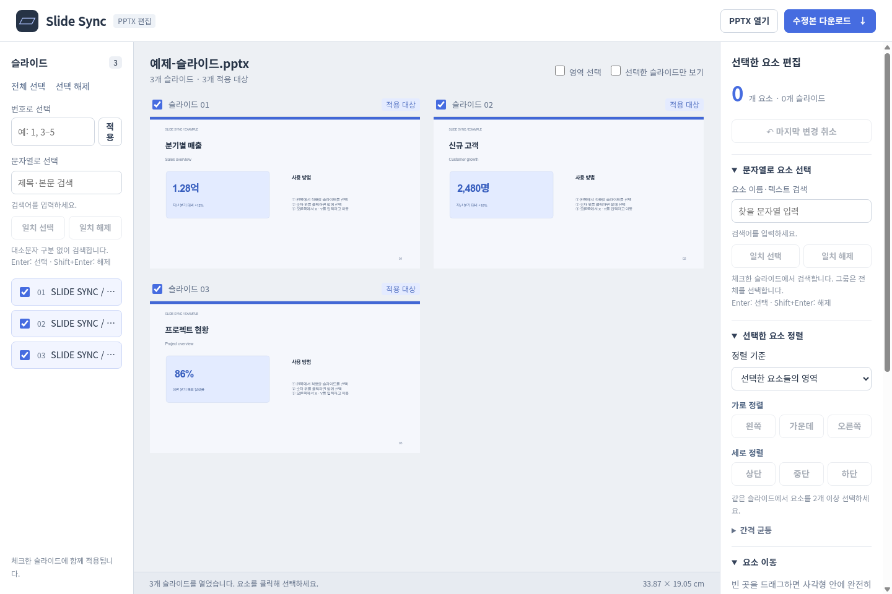
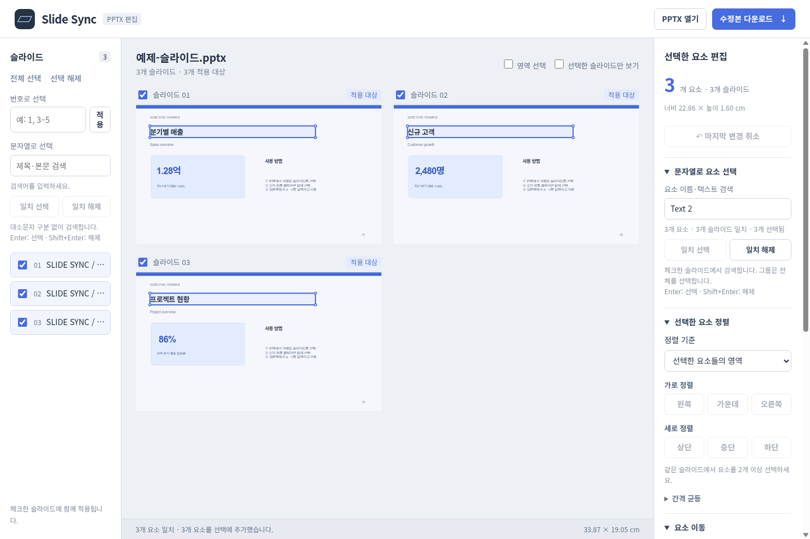

# Slide Sync

**Select and align recurring elements across PowerPoint slides in your browser.**

Open a PPTX, choose the slides and elements to update, then move or align them together and download the edited presentation. Files are processed in your browser and are never uploaded to a server.

[한국어](README.ko.md) · [Feature wiki (한국어)](docs/wiki.md) · [Development](docs/development.md) · [Cloudflare deployment](docs/deployment.md)



## Features

| Feature | What you can do |
| --- | --- |
| Edit across slides | Choose all or specific slides, then select and move corresponding elements at the same position |
| Find slides by text | Add matching slides to the editing scope or remove them |
| Find elements by text | Search element names and text within checked slides, then select or deselect matches |
| Rectangle selection | Drag a rectangle to select fully enclosed elements on each checked slide |
| Move, align and distribute | Use coordinates, dragging or arrow keys; align horizontally or vertically; distribute spacing |
| Fit text boxes | Adjust text box height to fit its content |
| Guides | Add, move, delete and save horizontal and vertical guides |
| Preview, undo and export | Preview master/layout artwork, undo changes and download an edited PPTX |

## How to use

The app's controls are currently in Korean.

1. Choose **PPTX 열기** (Open PPTX), or **예제 슬라이드로 사용해 보기** to try the included sample.
2. Check the **slides to edit** in the left sidebar. Use text search to find matching slides.
3. Click elements in the preview, drag a selection rectangle, or use **문자열로 요소 선택** (Select elements by text) on the right.
4. Apply alignment, movement, text fitting or guides. Use **마지막 변경 취소** to undo a change.
5. Choose **수정본 다운로드** to download the edited presentation.

## Select recurring elements by text

To align titles in the sample deck, check the target slides, search for their element name `Text 2` on the right, and choose **일치 선택**. For other files, search using the relevant element name or text. Review the matches, then align or move the selected elements.



- The left search selects **slides**; the right search selects **elements within checked slides**.
- Typing alone does not change the selection. **일치 선택 / Enter** adds matches; **일치 해제 / Shift+Enter** removes them.
- Search is literal and case-insensitive. Slide search also includes text in tables and groups.
- To work on only matching slides, clear the slide scope with **선택 해제** before adding matches.

## Selection and alignment tips

- **Rectangle selection:** Drag from empty preview space to select fully enclosed elements. Hold Ctrl, Shift or Cmd when starting to add to the current selection.
- **Start over an element:** Enable **영역 선택** in the workspace toolbar. Press Escape to cancel a draft selection.
- **Slide alignment:** Align to the slide's edges or center, even with one selected element.
- **Selection alignment:** Align to the combined bounds of selected elements. This requires at least two elements on the same slide.
- **Groups:** Groups are selected and moved as a single unit.

## Run locally

Use the Node.js version in `.node-version`.

```sh
npm ci
npm run dev
```

Open the URL shown in the terminal. See [development](docs/development.md) for build and verification commands, and [Cloudflare Pages deployment](docs/deployment.md) for automatic deployment setup.

## Supported scope

- Supports `.pptx` files up to 50 MiB compressed, 300 MiB declared decompressed and 120 slides, with up to 25 undo operations.
- Fonts, effects, SmartArt, some shapes and charts may render differently from PowerPoint. Check the exported presentation in PowerPoint for final appearance.
- Slide search excludes speaker notes, text inside images and text found only in masters or layouts.

## Further reading

- [Editor architecture](docs/architecture.md)
- [Performance and verification](docs/performance.md)
- [Earlier version notes](docs/legacy-v5.md)
- [Third-party licenses](public/vendor/NOTICE.txt)
